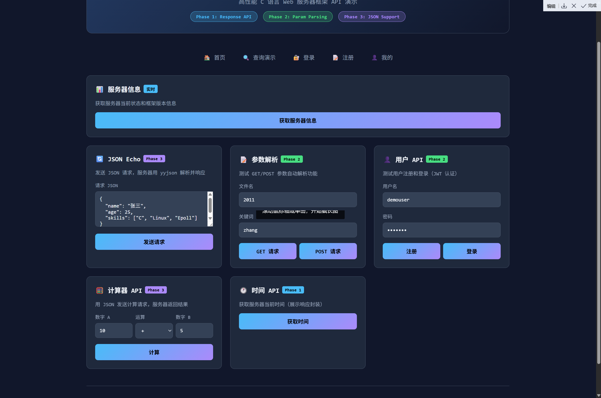

# 🚀 High-Performance Epoll Web Server


> **一个为了“极致性能”和“优雅开发体验”而生的 C 语言 Web 服务器框架。**

它不仅仅是一个玩具 demo，更是一个尝试还原 Nginx/Redis 核心高并发模型（Reactor）、具备完整 HTTP 协议解析、JWT 安全认证、动态路由分发能力的微型服务器框架。

现在，它更进化到了一个新的阶段：**拥有了现代化的 Response 封装、自动参数解析和原生 JSON 支持。**

---

## 🏗️ 架构设计 (Architecture)

本项目采用了经典的 **Library + Application** 分离架构，实现了核心引擎与业务逻辑的解耦。


### 📂 项目结构
*   **`epoll_server_core/` (The Engine)**: 底层核心库。
    *   **职责**: 封装 Socket/Epoll、HTTP 状态机解析、路由分发、日志系统、参数预解析、JSON 解析。
    *   **产物**: `libwebserver.a` 静态库。
*   **`user_backend/` (The App)**: 上层业务应用与前端演示。
    *   **职责**: 定义业务 API（登录/注册/搜索/JSON Echo/计算器/系统信息）、提供静态前端（含 `/demo.html` 全功能演示）。
    *   **产物**: `server_app` 可执行文件。

---

## ✨ 核心亮点 (Key Features)

### 1. ⚡ 极致性能：Epoll Reactor 模型
我们拒绝传统的“多线程阻塞”模型。本项目采用 **单线程 Reactor 模式** + **非阻塞 I/O** + **Epoll (Edge Triggered)**。
*   **优势**: 消除线程上下文切换开销，单核即可支撑数万并发连接。
*   **实现**: 主循环只负责事件分发，业务逻辑通过回调处理。

### 2. 🧠 智能解析：增量式 HTTP 状态机
TCP 传输中“粘包”和“半包”是常态。我们手写了一个鲁棒的**有限状态机 (FSM)**。
*   **增量解析**: 哪怕数据分十次到达，状态机也能记住上次解析的位置（`REQ_LINE` -> `HEADERS` -> `BODY`），无缝拼接请求。
*   **零阻塞**: 解析过程中任何时候数据不足，立即返回，绝不阻塞线程。

### 3. 📝 健壮工程：双日志与缓冲系统
*   **Access Log**: 记录标准 HTTP 请求日志。
*   **System Log**: 记录内核调试信息。
*   **启动缓冲 (Log Buffer)**: 即使在配置文件加载前的启动初期，日志也会被暂存在内存中，待配置加载后自动回放写入文件，确保**零丢失**。

### 4. 🛡️ 安全认证：JWT 集成
内置 **l8w8jwt** 库，提供标准的 `Authorization: Bearer <token>` 验证机制。实现无状态的用户鉴权，适合分布式扩展。

### 5. 🚀 现代化的开发体验 (Phase 1-3)
谁说写 C 语言 Web 后端一定很痛苦？看看我们的新特性：
*   **告别手动 `free`**: 请求参数（Query/Form）自动解析并绑定生命周期，用完即走。
*   **原生 JSON 支持**: 集成高性能 **yyjson** 库。请求体自动解析为文档，响应体一行代码直接发送文档。
*   **优雅的 Response API**: 无论是极速发送 `http_send_json` 还是精细控制 Header，都得心应手。
*   **Request/Response 封装**：`HttpRequest` 自动预解析 Query/Form/JSON；`HttpResponse` 既可一行返回（`http_send_*`），也可手术刀式定制 Header/Body。

---

## 🛠️ 快速开始 (Quick Start)

### 1. 获取源码
因为使用了 submodule 管理核心库，请务必使用递归克隆：

```bash
git clone --recursive https://github.com/William-2025/School_Project_Week3.git
cd School_Project_Week3
```
*(如果忘记加 `--recursive`，请执行 `git submodule update --init --recursive`)*

### 2. 环境依赖与第三方库

本项目依赖 OpenSSL 和 libk (用于 JWT 库)。

*   **Linux (Ubuntu/Debian)**:
    ```bash
    sudo apt-get install libssl-dev
    ```

*   **yyjson**:
    高性能 JSON 库 `yyjson` 的源码已经包含在 `epoll_server_core/deps/yyjson` 中。
    如果你的 `deps` 目录为空，请检查是否执行了 `git submodule update --init --recursive`。

### 3. 编译与运行
**注意**：所有编译和运行操作都在 `user_backend` 目录下进行，这会自动触发核心库的编译。

```bash
# 进入业务后端目录
cd user_backend

# 增量编译
make
# 或全量重建（含核心库）
make rebuild

# 启动服务器（推荐传配置文件）
./bin/server_app conf/server.conf
```

看到如下日志说明启动成功：
```
[INFO] Server starting on port 8888...
```

打开浏览器访问：
* `http://localhost:8888`        首页
* `http://localhost:8888/demo.html` 全功能 API 演示页（推荐）

---

## 📚 文档中心

我们准备了极其详尽的文档，满足不同层次的需求：

*   📖 **[开发者手册 (User Guide)](./docs/DEVELOPER_GUIDE.md)**  
    **（强烈推荐）** 如果你是来使用这个框架写业务的，看这里！包含了如何构建、配置、使用 API、解析 JSON 等保姆级教程。

*   🏗️ **[架构与设计 (Architecture)](./docs/ARCHITECTURE_AND_DESIGN.md)**  
    如果想深入理解 Epoll 循环、状态机原理、或者想学习如何设计一个 C 语言库，请阅读这篇源码级剖析。

*   **[旧版本概述.md](./docs/旧版本概述.md)**
    这篇旧版本概述，写于请求结构体自动解码、Response结构体设计、优雅Response函数实现、yyjson集成之前。但通过阅读它，依旧可以了解到项目的具体架构和一些核心的实现思路。


---

## 📸 运行截图

### 首页与静态资源
服务器能够快速响应 HTML、CSS、JS 及图片资源。


### 动态 API 与 JWT 鉴权
支持 POST 表单提交，并使用 Token 保护 `/api/me` 等私有接口。


### 新增 Demo 页 (Phase 1-3 综合)
`/demo.html` 展示 JSON Echo、参数解析、JWT 登录、计算器、系统信息、时间 API。
