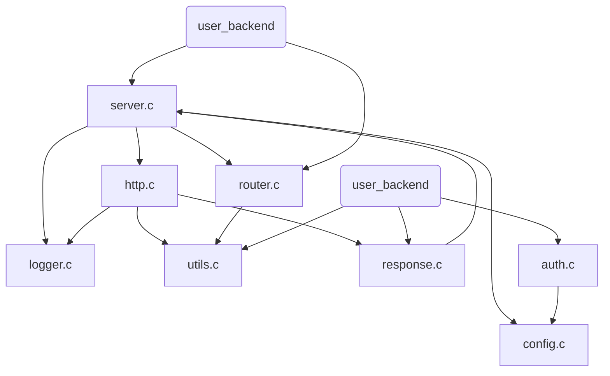

# 深入架构与实现细节：打造一个 Epoll Web 服务器

> **写在前面**：  
> 这不仅是一份文档，更是我写下这几千行 C 代码时的思考笔记。如果你想知道“为什么这里要用函数指针”、“为什么 HTTP 解析要写成状态机”、“为什么日志系统要搞个缓冲队列”，这篇文章会给你答案。我们不谈空洞的理论，只谈在代码里落地的实现。

---

## 1. 顶层架构设计 (Architecture)

### 1.1 宏观分层：库 (Library) 与 应用 (Application)

很多初学者写服务器时，习惯把 `main` 函数、`socket` 创建、业务逻辑全写在一个文件里。这在前期很爽，但一旦你想加个新功能，整个代码就会变成“意大利面条”。

本项目在设计之初，就确立了**“核心与业务分离”**的原则。

```mermaid
graph TD
    subgraph User Space
        App[用户后端应用 (user_backend)]
        Lib[核心服务器库 (epoll_server_core / libwebserver.a)]
    end
    
    subgraph Kernel Space
        Net[TCP/IP Stack]
        FS[File System]
    end

    App -->|1. 注册路由 & 回调| Lib
    App -->|2. 加载配置| Lib
    App -->|3. 启动 Loop| Lib
    
    Lib -->|epoll_wait| Net
    Lib -->|read/write| Net
    Lib -->|open/read| FS
```

*   **Server Core (`epoll_server_core/`)**：这是底座。它封装了所有脏活累活——Socket 编程、Epoll 事件管理、协议解析、静态文件读取、日志记录。它被编译成一个静态库 `libwebserver.a`。它**不知道**具体的业务是什么，它只知道“有人发了请求，我该调用哪个函数”。
*   **User Backend (`user_backend/`)**：这是上层建筑。它**不关心** TCP 握手几次，也不关心 HTTP 报文怎么切分。它只负责定义业务逻辑（比如“登录”、“查询”），并通过 `router_add_route` 告诉核心库。

> **项目整体架构图**：清晰展示了 Library 与 Application 的分层关系。
> 

---

### 1.2 模块划分与依赖关系

在核心库内部，我们进一步拆解了模块，尽量做到**高内聚、低耦合**。
特别是在引入了 **Response 封装** 和 **yyjson** 之后，各模块的职责更加清晰：



| 模块 | 源文件 | 职责 | 依赖关系 |
| :--- | :--- | :--- | :--- |
| **Server** | `server.c` | **主控中心**。负责启动 socket，管理 epoll 循环，分发事件。 | 依赖所有核心模块 |
| **HTTP** | `http.c` | **协议翻译官**。实现 HTTP 状态机解析请求，调用 Utils 解析参数。 | 依赖 Utils, Logger, Response |
| **Response** | `response.c` | **回复构建者**。Phase 1 核心，封装 HTTP 响应报文的组装与发送。 | 依赖 Server (写队列) |
| **Utils** | `utils.c` | **多功能瑞士军刀**。负责 URL 解码，以及 **yyjson** 的请求体解析。 | 无 |
| **Auth** | `auth.c` | **门卫**。基于 JWT 的生成与校验。 | 依赖 `l8w8jwt` |

---

## 2. 核心技术实现与源码剖析

### 2.1 为什么选择 Epoll Edge Triggered (ET)？

在 `server.c` 的 `make_socket_non_blocking` 和 `epoll_ctl` 调用中，你会发现我们不仅用了 `O_NONBLOCK`，还开启了 **ET (边缘触发)** 模式。

*   **LT (水平触发)**：只要缓冲里有数据，Epoll 就会一直通知你。比较稳妥，但如果不及时处理，会产生大量重复通知，浪费 CPU。
*   **ET (边缘触发)**：只有数据**从无到有**（或状态变化）的那一瞬间，Epoll 通知你一次。

**本项目选择 ET + 非阻塞 I/O 的思考**：
我们希望极致压榨性能。在 ET 模式下，当 `epoll_wait` 返回某个 socket 可读时，我们必须**一次性把数据读完**（循环调用 `read` 直到返回 `EAGAIN`）。这减少了 `epoll_wait` 系统调用的次数。虽然编程难度变大了（必须处理数据没读完的情况），但换来的是在高并发下的更高吞吐量。

### 2.2 核心算法：基于状态机的增量式 HTTP 解析

这是本项目最硬核的部分。请打开 `epoll_server_core/src/http.c`。

**问题背景**：
在 TCP 网络编程中，**“粘包”**（多个请求合在一起发）和**“半包”**（一个请求分两次发）是常态。

**解决方案：有限状态机 (FSM)**
我们定义了一个 `ParsingState` 枚举，意味着每个连接都有自己独立的解析进度。

```c
typedef enum {
    PARSE_STATE_REQ_LINE, // 正在找 "GET /path HTTP/1.1\r\n"
    PARSE_STATE_HEADERS,  // 正在找 "Header: Value\r\n"
    PARSE_STATE_BODY,     // 正在读 Body
    PARSE_STATE_COMPLETE  // 读完了
} ParsingState;
```

这种设计让我们的服务器可以处理**任意分片**的请求。哪怕客户端一个字节一个字节地发，我们的状态机也能正确拼装出请求，而不会阻塞线程等待数据。

### 2.3 现代化开发体验升级 (Phase 1-3 实现细节)

为了让这个 C 语言服务器真正“好用”，我们在最近的迭代中引入了三个关键特性。

#### 2.3.1 告别手搓报文：Response Layer (Phase 1)

**痛点**：以前写 API，得手动 `snprintf` 拼 HTTP 头，容易算错 `Content-Length`，还容易忘写 `\r\n`。

**解法**：我们引入了 `HttpResponse` 对象和一系列 Setter 方法。
在 `src/response.c` 中，我们并没有用复杂的内存池，而是采用了一种轻量级的策略：结构体只存指针和元数据，直到发送前最后一刻，才调用 `http_response_send` 将这些元数据序列化到 TCP 发送缓冲中。

这既保留了 C 的高性能（零拷贝），又提供了类似高级语言的对象操作体验。

#### 2.3.2 参数自动装填：Parameter Parsing (Phase 2)

**痛点**：`get_query_param` 返回的字符串需要用户手动 `free`，这简直是内存泄漏的温床。

**解法**：我们在 `HttpRequest` 生命周期结束时（即请求处理完），统一进行清理。
在 `src/utils.c` 中，新增了 `http_parse_all_params` 函数。它会在 HTTP 状态机进入 `COMPLETE` 状态后立即运行，自动扫描 Query String 和 Body，将结果“预存”到 `conn->request.query_params` 数组中。

**关于 `MAX_HEADERS` 和 `MAX_PARAMS` 的取舍**：
你会发现 `http.h` 中定义了 `MAX_HEADERS 32` 和 `MAX_PARAMS 32`。这确实是一个硬限制。
*   **为什么这么做？**：为了保持代码极度简单且内存布局连续（对 CPU 缓存友好），避免在请求解析阶段频繁进行 `malloc`/`realloc`。在 99% 的轻量级 API 场景下，32 个 Header 或参数完全够用。
*   **优化方向**：如果要支持超长参数列表，未来可以重构成链表或动态扩容数组。或者引入 `uthash` 这样的成熟第三方库来管理 K/V 结构，从而实现 O(1) 的查找和动态内存管理。

#### 2.3.3 原生 JSON 支持：Integrated yyjson (Phase 3)

**痛点**：现代 API 都是 JSON 格式，每次都自己引库、解析太麻烦。

**解法**：我们将高性能的 `yyjson` 库直接嵌入核心。
*   **进**：当 `Content-Type: application/json` 时，框架自动解析成 `yyjson_doc`（不可变文档），挂载到 Request 上。
*   **出**：提供 `http_send_json_doc`，接受一个 `yyjson_mut_doc`（可变文档），自动序列化为字符串并发送。

---

## 3. 业务层设计：回调与扩展

### 3.1 动态路由机制与回退策略

在 `epoll_server_core/src/router.c` 中，我们维护了一个简单的链表路由表。
当一个请求到达时，服务器会优先查找是否有匹配的 API Handler。如果**没有找到匹配的路由**，服务器会自动回退到 **静态文件服务 (`handleStaticRequest`)**，尝试在 `DocumentRoot` 下查找对应的文件。

这种设计非常适合单页应用 (SPA) 或简单的静态网站托管。

### 3.2 现在的 API 代码长什么样？

得益于上述的升级，现在写一个 API 异常清爽：

```c
void handle_demo(Connection* conn, ...){
    // 1. 拿参数 (不用 free)
    const char* id = http_get_param(&conn->request, "id");
    
    // 2. 拿 JSON (原生对象操作)
    yyjson_val* root = conn->request.json_root;
    int val = yyjson_get_int(yyjson_obj_get(root, "val"));
    
    // 3. 发回 JSON (一行代码)
    http_send_json(conn, 200, "{\"status\":\"ok\"}", epollFd);
}
```

---

## 4. 总结

**Epoll Web Server** 展示了如何用 C 语言构建一个**现代**、**高性能**、**可维护**的网络服务。它证明了 C 语言不仅能做底层的 Epoll 循环，通过合理的封装，也能拥有不输高级语言的开发体验。

> *希望这份文档能帮你读懂源码，更希望能激发你自己动手写一个服务器的冲动。Happy Coding!*
