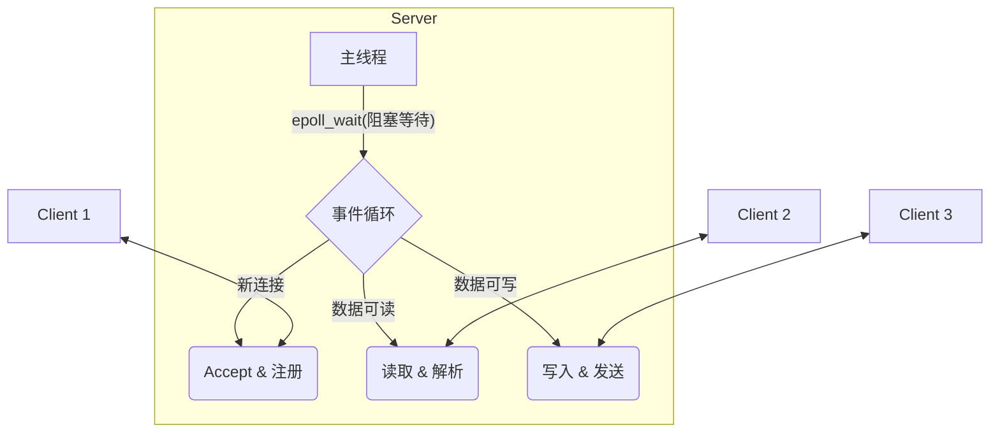
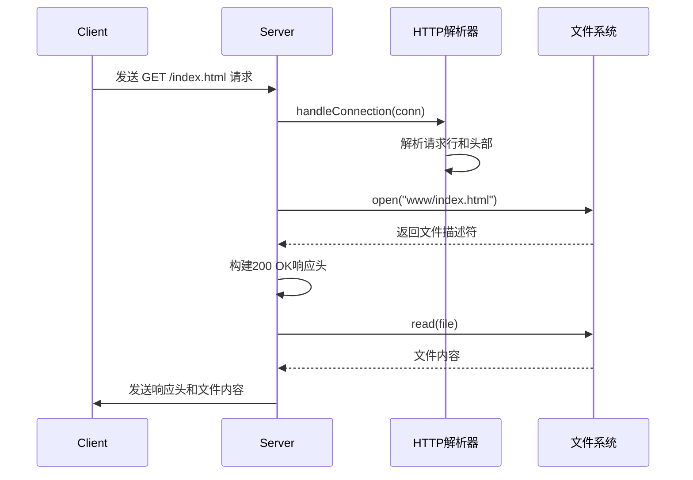
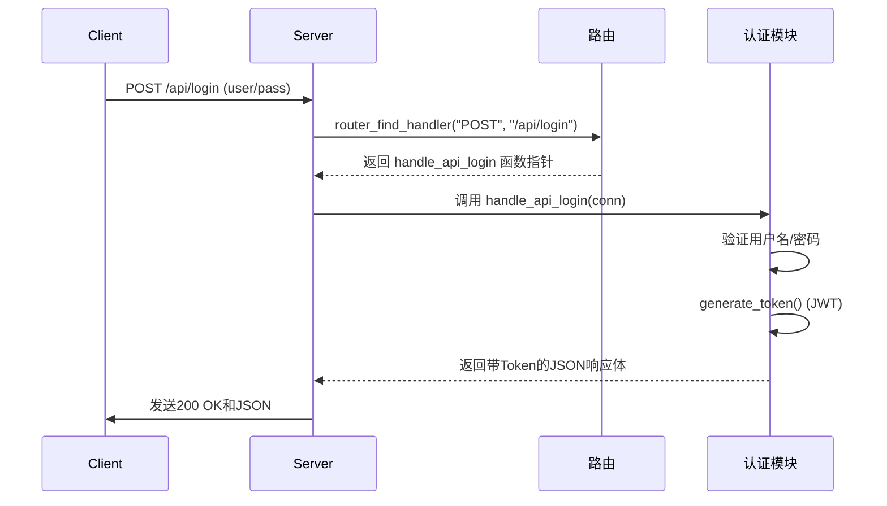

<style>
/* 
  您好！这是为您定制的 Marp 演示文稿样式。
  我已经在这里添加了更丰富的样式，并用中文注释标明了所有您可以修改的地方。
  您可以直接修改这里的数值来调整外观。
*/

/* --- 1. 全局与页面布局 --- */
section {
    /* 字体族: 优先使用系统UI字体，确保中英文显示效果。*/
    font-family: -apple-system, BlinkMacSystemFont, "Helvetica Neue", "Segoe UI", "Hiragino Kaku Gothic ProN", "Hiragino Sans", "ヒラギノ角ゴ ProN W3", Arial, "メイリオ", Meiryo, "Microsoft YaHei", "微软雅黑", sans-serif;
    
    /* 基础字号: 调整这个值可以改变整个页面的基础字体大小。*/
    font-size: 24px;

    /* 页面背景色: */
    background-color: #ffffff; /* 纯白背景 */

    /* 默认文字颜色: */
    color: #333; /* 深灰色文字，比纯黑更柔和，阅读更舒适 */

    /* 内容对齐: 全局左对齐，符合严谨的阅读习惯。*/
    text-align: left;
    
    /* 内容垂直对齐: 从顶部开始，而不是垂直居中。*/
    justify-content: start;
    
    /* 页面内边距: 页面内容与边缘的距离。第一个值是上下，第二个值是左右。*/
    padding: 50px 70px;
}

/* --- 2. 标题样式 (H1, H2, H3) --- */
h1, h2, h3, h4, h5, h6 {
    /* 标题颜色: */
    color: #003366; /* 标题使用深蓝色，显得专业 */
    
    /* 标题字重: 600是半粗体。*/
    font-weight: 600;

    /* 标题下方间距: */
    margin-bottom: 0.6em; /* 标题和下方内容之间留出空隙 */
}

h1 {
    /* H1 标题字号 */
    font-size: 44px;
    border-bottom: 2px solid #0055aa; /* 给主标题加一条下划线 */
    padding-bottom: 0.2em; /* 下划线与文字的距离 */
}
h2 { font-size: 36px; }
h3 { font-size: 28px; }

/* --- 3. 文本与段落样式 --- */
p {
    /* 文本行距: 这是最重要的排版设置之一！调整这个值可以改变段落的行间距。*/
    line-height: 1.8;
    
    /* 段落下方间距: */
    margin-bottom: 1em;
}

/* --- 4. 列表样式 (无序/有序) --- */
ul, ol {
    /* 列表行距: */
    line-height: 1.8;
    
    /* 列表左侧缩进: */
    margin-left: 30px;
}

/* --- 5. 其他元素样式 (链接/引用/代码/表格/图片) --- */
/* 链接样式 */
a {
    color: #0066cc; /* 链接颜色 */
    text-decoration: none; /* 去掉下划线 */
}
a:hover {
    text-decoration: underline; /* 鼠标悬浮时显示下划线 */
}

/* 引用块样式 */
blockquote {
    background: #f9f9f9; /* 浅灰色背景 */
    border-left: 5px solid #ccc; /* 左侧的灰色竖线 */
    margin: 1.5em 0;
    padding: 0.5em 20px;
    font-style: italic; /* 斜体 */
}

/* 代码样式 */
/* 内联代码 `code` */
code {
    background-color: #eef;
    padding: 0.2em 0.4em;
    border-radius: 3px;
    font-size: 0.9em;
}
/* 代码块 <pre><code> */
pre code {
    background-color: #f7f7f7;
    border: 1px solid #ddd;
    display: block;
    padding: 1em;
    border-radius: 5px;
    font-size: 0.85em;
    line-height: 1.6;
}

/* 表格样式 */
table {
    width: 100%;
    border-collapse: collapse; /* 合并边框 */
    margin-bottom: 1em;
}
th, td {
    border: 1px solid #ddd; /* 单元格边框 */
    padding: 8px 12px; /* 单元格内边距 */
    text-align: left;
}
th {
    background-color: #f2f2f2; /* 表头背景色 */
    font-weight: bold;
}

/* --- 6. 页脚与页码 --- */
footer {
    position: absolute;
    bottom: 25px; /* 距离底部的位置 */
    left: 40px;
    right: 40px;
    font-size: 16px; /* 页脚字号 */
    color: #777;
}

/* --- 7. 特殊页面样式：章节页 --- */
/*
  我们不再需要 .chapter 类和伪元素，
  直接对 Marp 的原生 <header> 元素进行样式化。
*/
section > header {
    /* 定位与样式 */
    position: absolute; /* 绝对定位 */
    top: 30px;          /* 距离顶部 30px */
    left: 70px;         /* 距离左侧 70px (与页面内边距一致) */
    right: auto;        /* 覆盖掉可能存在的右对齐 */
    
    /* 外观 */
    font-size: 20px;    /* 字体大小 */
    font-weight: bold;  /* 字体加粗 */
    color: #555;        /* 页眉颜色 */
    text-align: left;   /* 确保文字左对齐 */
}

</style>

# 这是您的报告标题

- 报告人：您的名字
- 日期：YYYY-MM-DD

---

## 样式展示：文本与列表

这是一个普通的段落，我们为它设置了 **1.8** 的行高 (`line-height`)，您可以在 `<style>` 的 `p` 选择器中找到并修改它。这让长段落的中文阅读起来不再拥挤。

> 这是一个引用块（blockquote），它有自己独特的背景和左边框，适合引用他人的话或者突出显示某段文字。

下面是一个列表：
- 列表项同样应用了 **1.8** 的行高。
- 列表的左侧缩进 (`margin-left`) 也可以在 `ul, ol` 样式中调整。
- 这是一个[示例链接](https://marp.app/)，鼠标放上去会显示下划线。

---

## 样式展示：代码与表格

我们可以很方便地展示代码。比如，这是一段内联代码：`const a = 1;`。

下面是一个代码块：
```javascript
// 代码块有自己的背景、边框和字体样式
function greet(name) {
  console.log(`Hello, ${name}!`);
}

greet('Marp');
```

表格也经过了美化，包含了边框和表头背景：

| 姓名 | 学号 | 成绩 |
| :--- | :--- | :--- |
| 张三 | 1001 | 95   |
| 李四 | 1002 | 88   |

---

<!-- 
  ==============================================================
  使用方法：
  在需要作为章节页的幻灯片上方，添加 header 指令即可：
  `<!-- _header: '您想显示的章节标题' -->`

<!-- _header: ' ' -->

# 高性能轻量级Web服务器
## 设计与实现

- **汇报人：** (请替换为您的名字)
- **日期：** (请替换为您的日期)

---

<!-- _header: '第一章：项目概述' -->

## 1. 项目概述

**目标：** 构建一个基于 Linux C 语言的、轻量级、高性能、可作为库嵌入到其他应用的事件驱动Web服务器。

**核心技术栈：**
- **I/O 模型:** `epoll` 边缘触发 (ET) + 非阻塞 Socket
- **并发模型:** 单线程 Reactor 并发模型
- **协议支持:** HTTP/1.1 (GET, POST)
- **项目结构:** 核心库与用户应用分离

---

<!-- _header: '第二章：核心架构设计' -->

## 2. 核心架构设计：Reactor 模型

本项目采用经典的 **Reactor 并发模型**，将所有I/O操作（监听、读、写）视为“事件”，由一个主循环线程统一监听和分发。



- **优点**:
    - **高并发**: 单线程处理海量连接，避免了多线程上下文切换的开销。
    - **低延迟**: 事件驱动，只有当I/O就绪时才进行处理。
    - **实现清晰**: 所有I/O逻辑集中管理，易于维护。

---

<!-- _header: '第二章：核心架构设计' -->

## 2.1 模块化与代码组织

为了实现高内聚、低耦合，项目在代码层面进行了清晰的模块化，并实现了**核心库**与**用户应用**的物理分离。

- **核心服务器库 (`Web_Server_for_Learning`)**
  - **`src/` & `include/`**: 包含服务器的核心逻辑，如 `server`, `http`, `logger`, `router` 等。
  - **`lib/`**: 最终被编译成 `libwebserver.a` 静态库，供外部使用。
- **用户后端应用 (`user_backend`)**
  - **`src/` & `include/`**: 包含用户自定义的业务逻辑，如 `main.c`, `api.c`。
  - **`Makefile`**: 负责链接核心库，并编译成最终的可执行文件。

**这种设计，使得服务器核心的升级与用户业务代码的开发可以完全独立进行。**

---

<!-- _header: '第三章：功能实现与演示' -->

## 3. 功能实现：请求处理流程 (GET)

以请求博客首页为例，展示静态 GET 请求的处理流程。



**演示点**: Index界面、博客网站（图片等多种类型文件）、错误响应（404）。

---

<!-- _header: '第三章：功能实现与演示' -->

## 3.1 功能实现：请求处理流程 (POST)

以用户登录接口为例，展示动态 POST 请求的处理流程。


**演示点**: POST/GET实现、安全认证 (JWT)。

---

<!-- _header: '第三章：功能实现与演示' -->

## 3.2 功能实现：配置与日志系统

服务器的健壮性离不开灵活的配置和详细的日志。

- **配置文件 (`server.conf`)**
  - 运行时动态加载，可配置端口、文档根目录、日志级别与路径等。
  - `LogLevel` 支持 DEBUG, INFO, WARNING, ERROR。
  
- **双日志系统**
  - **`access.log`**: 记录每一次HTTP请求的摘要，便于追踪访问。
  - **`system.log`**: 记录服务器内部运行状态、调试信息和错误，是排错的关键。
  - **日志缓冲机制**: 解决了启动初期的“鸡生蛋”问题，确保所有日志都能按配置输出。
  
**演示点**: 系统日志、配置文件。

---

<!-- _header: '第四章：核心算法剖析' -->

## 4. 核心算法：增量式HTTP解析

**挑战**: TCP是面向字节流的协议，一个完整的HTTP请求可能被分割在多个TCP包中，也可能多个HTTP请求挤在一个包里。如何准确地识别请求边界？

**解决方案**: **基于状态机的增量式解析算法**。

1.  为每个连接维护一个独立的读缓冲区 (`read_buf`) 和解析状态 (`ParsingState`)。
2.  `epoll` 每次触发 `EPOLLIN` 事件，都从 socket `read` 数据追加到缓冲区。
3.  解析器从上次结束的位置 (`parsed_offset`) 继续扫描，根据当前状态（如 `PARSE_STATE_REQ_LINE`）寻找对应的分隔符（`\r\n`）。
4.  找到则转换到下一状态（`PARSE_STATE_HEADERS`），更新偏移量。
5.  找不到则保留当前状态和缓冲区，等待下一次 `EPOLLIN` 事件。

**此设计是服务器能成功通过“超长消息测试”的关键。**

---

<!-- _header: '第五章：总结与展望' -->

## 5. 项目总结

- **完成度**: 高质量实现了需求文档中的所有核心功能。
- **架构设计**: 采用业界成熟的 **Reactor** 模型，保证了高性能与高并发。
- **代码质量**: 实现了**库/应用分离**的模块化设计，代码结构清晰，可维护性强。
- **技术难点**: 攻克了基于 `epoll` ET 模式的**非阻塞I/O编程**与**增量式协议解析**等核心技术。

---

<!-- _header: '第五章：总结与展望' -->

## 5.1 不足与展望

- **API封装**: 目前的用户API处理函数暴露了过多的底层细节（如`epollFd`），未来可设计更上层的API，由框架统一处理响应发送和日志记录。
- **性能优化**: 可引入多线程或线程池模型，将CPU密集型的业务逻辑（如复杂的API处理）与I/O线程分离，进一步提升性能。
- **功能扩展**:
  - 支持 **HTTPS**。
  - 实现更完善的 **Keep-Alive** 策略。

---

<!-- _header: ' ' -->

# 感谢聆听
## Q & A
