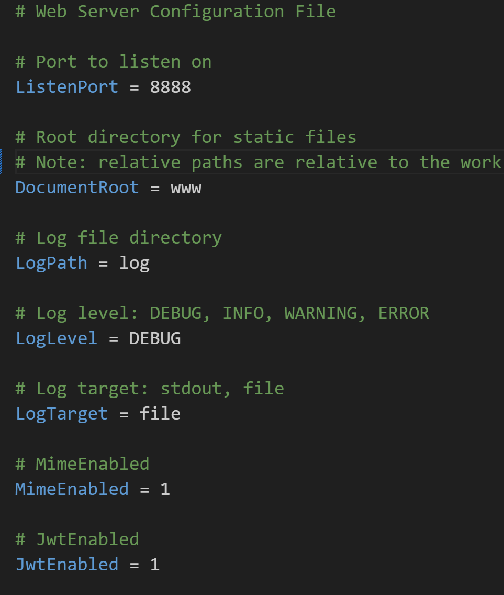
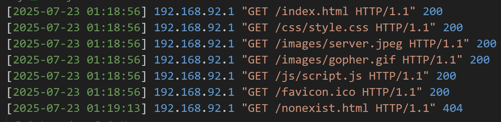
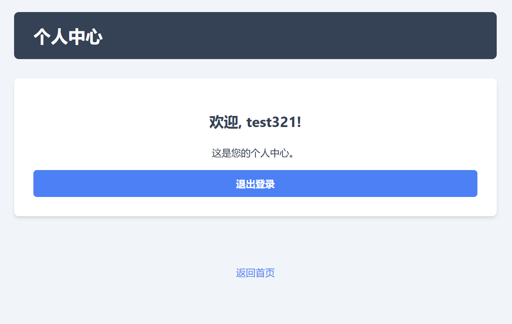

<style>
/* 
  您好！这是为您定制的 Marp 演示文稿样式。
  我已经在这里添加了更丰富的样式，并用中文注释标明了所有您可以修改的地方。
  您可以直接修改这里的数值来调整外观。
*/

/* --- 1. 全局与页面布局 --- */
section {
    /* 字体族: 优先使用系统UI字体，确保中英文显示效果。*/
    font-family: -apple-system, BlinkMacSystemFont, "Helvetica Neue", "Segoe UI", "Hiragino Kaku Gothic ProN", "Hiragino Sans", "ヒラギノ角ゴ ProN W3", Arial, "メイリオ", Meiryo, "Microsoft YaHei", "微软雅黑", sans-serif;
    
    /* 基础字号: 调整这个值可以改变整个页面的基础字体大小。*/
    font-size: 24px;

    /* 页面背景色: */
    background-color: #ffffff; /* 纯白背景 */

    /* 默认文字颜色: */
    color: #333; /* 深灰色文字，比纯黑更柔和，阅读更舒适 */

    /* 内容对齐: 全局左对齐，符合严谨的阅读习惯。*/
    text-align: left;
    
    /* 内容垂直对齐: 从顶部开始，而不是垂直居中。*/
    justify-content: start;
    
    /* 页面内边距: 页面内容与边缘的距离。第一个值是上下，第二个值是左右。*/
    padding: 50px 70px;
}

/* --- 2. 标题样式 (H1, H2, H3) --- */
h1, h2, h3, h4, h5, h6 {
    /* 标题颜色: */
    color: #003366; /* 标题使用深蓝色，显得专业 */
    
    /* 标题字重: 600是半粗体。*/
    font-weight: 600;

    /* 标题下方间距: */
    margin-bottom: 0.6em; /* 标题和下方内容之间留出空隙 */
}

h1 {
    /* H1 标题字号 */
    font-size: 44px;
    border-bottom: 2px solid #0055aa; /* 给主标题加一条下划线 */
    padding-bottom: 0.2em; /* 下划线与文字的距离 */
}
h2 { font-size: 36px; }
h3 { font-size: 28px; }

/* --- 3. 文本与段落样式 --- */
p {
    /* 文本行距: 这是最重要的排版设置之一！调整这个值可以改变段落的行间距。*/
    line-height: 1.8;
    
    /* 段落下方间距: */
    margin-bottom: 1em;
}

/* --- 4. 列表样式 (无序/有序) --- */
ul, ol {
    /* 列表行距: */
    line-height: 1.8;
    
    /* 列表左侧缩进: */
    margin-left: 30px;
}

/* --- 5. 其他元素样式 (链接/引用/代码/表格/图片) --- */
/* 链接样式 */
a {
    color: #0066cc; /* 链接颜色 */
    text-decoration: none; /* 去掉下划线 */
}
a:hover {
    text-decoration: underline; /* 鼠标悬浮时显示下划线 */
}

/* 引用块样式 */
blockquote {
    background: #f9f9f9; /* 浅灰色背景 */
    border-left: 5px solid #ccc; /* 左侧的灰色竖线 */
    margin: 1.5em 0;
    padding: 0.5em 20px;
    font-style: italic; /* 斜体 */
}

/* 代码样式 */
/* 内联代码 `code` */
code {
    background-color: #eef;
    padding: 0.2em 0.4em;
    border-radius: 3px;
    font-size: 0.9em;
}
/* 代码块 <pre><code> */
pre code {
    background-color: #f7f7f7;
    border: 1px solid #ddd;
    display: block;
    padding: 1em;
    border-radius: 5px;
    font-size: 0.9em;
    line-height: 1.6;
}

/* 表格样式 */
table {
    width: 100%;
    border-collapse: collapse; /* 合并边框 */
    margin-bottom: 1em;
}
th, td {
    border: 1px solid #ddd; /* 单元格边框 */
    padding: 8px 12px; /* 单元格内边距 */
    text-align: left;
}
th {
    background-color: #f2f2f2; /* 表头背景色 */
    font-weight: bold;
}

/* --- 6. 页脚与页码 --- */
footer {
    position: absolute;
    bottom: 25px; /* 距离底部的位置 */
    left: 40px;
    right: 40px;
    font-size: 16px; /* 页脚字号 */
    color: #777;
}

/* --- 7. 特殊页面样式：页眉 --- */
/*
  我们不再需要 .chapter 类和伪元素，
  直接对 Marp 的原生 <header> 元素进行样式化。
*/
section > header {
    /* 定位与样式 */
    position: absolute; /* 绝对定位 */
    top: 30px;          /* 距离顶部 30px */
    left: 70px;         /* 距离左侧 70px (与页面内边距一致) */
    right: auto;        /* 覆盖掉可能存在的右对齐 */
    
    /* 外观 */
    font-size: 20px;    /* 字体大小 */
    font-weight: bold;  /* 字体加粗 */
    color: #555;        /* 页眉颜色 */
    text-align: left;   /* 确保文字左对齐 */
}

/* --- 8. 特殊页面样式：章节页 --- */
section.chapter {
    /* 水平居中 */
    text-align: center;
    
    /* 垂直居中 (利用flex布局的特性) */
    justify-content: center;
    
    /* 可以给章节页一个独特的背景色以示区别 */
    background-color: #f0f4f8; 
}

section.chapter h1 {
    /* H1 标题字号 */
    font-size: 60px;
    border-bottom: none;
}

/* --- 9. 图片题注样式 --- */
figure {
    /* 让整个figure块在页面中居中，并且没有多余边距 */
    margin: 1em auto;
    padding: 0;
    text-align: center;
}

figcaption {
    /* 题注样式 */
    margin-top: 0.5em;       /* 题注与图片之间的距离 */
    font-size: 0.8em;        /* 字号比正文小一点 */
    color: #555;             /* 使用柔和的灰色 */
    font-style: italic;      /* 斜体，有说明的感觉 */
}

/* --- 10. 左右分栏布局样式 --- */
.columns {
    display: flex;
    gap: 20px; /* 两栏之间的间距 */
    align-items: flex-start; /* 顶部对齐 */
    width: 100%;
}
.col {
    flex: 1; /* 各栏等宽 */
}
.col img {
    width: 100%; /* 图片宽度自动适应栏宽 */
    border: 1px solid #ddd; /* 给图片加一个浅色边框 */
    border-radius: 4px;
}

</style>

<!-- _header: '' -->

# 基于epoll的高性能轻量级Web服务器
## 设计与实现

- **汇报人：谭宇轩**
- **日期：2025年7月23日**

---

<!-- _class: chapter  -->
# 第一部分：项目概述

---

<!-- _header: '第一部分：项目概述' -->

## 项目定位：一个框架，而非应用

本次项目旨在开发一个**轻量级、可嵌入的Web服务器『框架』**。

- **核心价值**: 提供稳定可靠的HTTP处理核心，将开发者从复杂的底层I/O与协议解析中解放出来。
- **设计哲学**: 给予上层业务开发者最大的**自由度**去实现自定义逻辑。
- **本次展示**: 为演示框架能力，本项目基于此框架构建了一个**示例后端应用** (`user_backend`) 和配套的前端界面。

---

<!-- _header: '第一部分：项目概述' -->

## 整体架构

项目由**前端应用**、**用户后端**和**核心服务器库**三部分组成，关系如下：


---

<!-- _class: chapter  -->
# 第二部分：核心库设计与实现

---

<!-- _header: '第二部分：核心库设计与实现' -->

## 核心库内部依赖关系

`libwebserver.a` 内部模块职责清晰，依赖关系明确，体现了高内聚、低耦合的设计思想。


---

<!-- _header: '第二部分：核心库设计与实现' -->

## 项目目录结构

规范的目录结构保证了项目代码的清晰度和可维护性。

```
├── Web_Server_for_Learning/  # 核心服务器库
│   ├── src/                  # 核心库源文件 (*.c)
│   ├── include/              # 核心库头文件 (*.h)
│   ├── deps/                 # 第三方依赖 (l8w8jwt)
│   ├── lib/                  # 生成的 libwebserver.a
│   └── Makefile              # 库编译脚本
├── user_backend/             # 用户示例应用
│   ├── src/                  # 用户业务逻辑 (api.c, main.c)
│   ├── include/
│   ├── www/                  # 前端静态资源 (html, css, js)
│   ├── log/                  # 日志文件 (access.log, system.log)
│   ├── conf/                 # 配置文件 (server.conf)
│   └── Makefile              # 应用编译脚本
└── ...
```

---

<!-- _class: chapter  -->
# 第三部分：功能点展示

---

<!-- _header: '第三部分：功能点展示' -->

## 功能点展示顺序

接下来，我将按照以下顺序，结合代码和现场演示，逐一介绍服务器的核心功能：

1.  **静态服务** (Index/博客) **& 错误响应**
2.  **配置系统 & 日志系统**
3.  **动态服务** (GET / POST 实现)
4.  **安全认证**
5.  **核心服务逻辑** (Epoll)

---

<!-- _header: '第三部分：功能点展示 | 1. 静态服务 & 错误响应' -->

### 1. 静态服务 & 错误响应 (概述)

- **功能**: 作为Web服务器，首要能力是提供静态资源服务，包括HTML页面、CSS样式表、JavaScript脚本和图片等。同时，当用户请求不存在的资源时，能返回规范的`404 Not Found`错误页面。

- **演示内容**:
  - 访问博客首页 `index.html`。
  - 首页能成功加载图片、CSS和JS文件。
  - 访问一个不存在的URL，服务器返回404错误页面。

---

<!-- _header: '第三部分：功能点展示 | 1. 静态服务 & 错误响应' -->

### 核心逻辑

`http.c`中的`handleStaticRequest`函数负责所有静态请求。
首先，它将请求的URI与配置的文档根目录安全地拼接成物理文件路径。
```c
// in http.c
char path[MAX_PATH_LEN];
snprintf(path, sizeof(path), "%s%s", config->document_root, uri);
```
然后，尝试打开文件。如果失败（如文件不存在），则构建并发送404响应。
```c
// in http.c
int fileFd = open(path, O_RDONLY);
if (fileFd == -1) {
    if (errno == ENOENT) { // File Not Found
        log_access(conn->client_ip, method, uri, 404);
        char response[] = "HTTP/1.1 404 Not Found\r\n...";
        queue_data_for_writing(conn, response, ...);
    }
    // ... other error handling
    return;
}
```
---
<!-- _header: '第三部分：功能点展示 | 1. 静态服务 & 错误响应' -->

### 核心逻辑 (续)
如果文件打开成功，则根据文件后缀名获取正确的MIME类型，并构建`200 OK`响应头。
```c
// in http.c
const char* mime_type = getMimeType(path); // e.g., "text/html"
char header[512];
int headerLen = snprintf(header, sizeof(header),
                         "HTTP/1.1 200 OK\r\n"
                         "Content-Type: %s\r\n"
                         "Content-Length: %ld\r\n\r\n",
                         mime_type, fileStat.st_size);
queue_data_for_writing(conn, header, headerLen, epollFd);
```
最后，循环读取文件内容，并将其写入响应队列，等待发送。
```c
// in http.c
char buffer[4096];
ssize_t bytesRead;
while ((bytesRead = read(fileFd, buffer, sizeof(buffer))) > 0) {
    queue_data_for_writing(conn, buffer, bytesRead, epollFd);
}
```

---
<!-- _header: '第三部分：功能点展示 | 1. 静态服务 & 错误响应' -->

### 运行结果展示

<div class="columns">
<div class="col">

**成功加载博客首页**


</div>
<div class="col">

**返回404错误页面**


</div>
</div>

---
<!-- _header: '第三部分：功能点展示 | 2. 配置与日志系统' -->

### 2. 配置与日志系统 (概述)

- **功能**: 为了提高灵活性和可维护性，服务器的行为由外部`server.conf`文件驱动。同时，系统配备了完善的双日志系统，用于追踪访问和排查问题。

- **演示内容**:
  - 展示 `server.conf` 文件的内容，说明可配置项。
  - 启动服务器，并查看 `log/` 目录下生成的 `access.log` 和 `system.log`。

---
<!-- _header: '第三部分：功能点展示 | 2. 配置与日志系统' -->

### 核心逻辑：配置文件加载
服务器启动时，`config.c`中的`loadConfig`函数会逐行解析配置文件。
它首先为所有配置项设置合理的默认值，然后读取文件，用`sscanf`和`strcmp`匹配键值对并覆盖默认值。
```c
// in config.c
while (fgets(line, sizeof(line), fp)) {
    char key[256], value[256];
    if (sscanf(line, "%255s = %255s", key, value) != 2) {
        continue;
    }

    if (strcmp(key, "ListenPort") == 0) {
        config->listen_port = atoi(trimmed_value);
    } else if (strcmp(key, "LogLevel") == 0) {
        // ... set log level
    }
    // ...
}
```
---
<!-- _header: '第三部分：功能点展示 | 2. 配置与日志系统' -->

### 亮点：启动时日志缓冲
在配置文件加载完成前，日志设置可能尚未指定完全，日志系统如何工作？这是一个“鸡生蛋”问题。
本项目设计了巧妙的日志缓冲机制：在日志系统未初始化时，`log_system`会将日志消息暂存入内存缓冲区。
```c
// in logger.c -> log_system()
if (!L.is_initialized) {
    // ... code to expand buffer if needed ...
    
    // Format message and store in buffer
    vasprintf(&message, format, args);
    log_buffer[buffer_count].level = level;
    log_buffer[buffer_count].message = message;
    buffer_count++;
    return;
}
```
---
<!-- _header: '第三部分：功能点展示 | 2. 配置与日志系统' -->

### 亮点：启动时日志缓冲 (续)
当`logger_init`根据配置完成初始化后，它会立即将缓冲区内容“回放”至指定日志文件，并清空缓冲区，确保所有日志都按最终配置输出。
```c
// in logger.c -> logger_init()
L.is_initialized = true;
// Now that the logger is configured, flush any buffered logs
flush_and_free_buffer();
```
---
<!-- _header: '第三部分：功能点展示 | 2. 配置与日志系统' -->

### 运行结果展示

<div class="columns">
<div class="col" style="flex: 0.8;">
<b>server.conf</b>

</div>
<div class="col">
<b>system.log (部分)</b>

<b>access.log (部分)</b>

</div>
</div>

---
<!-- _header: '第三部分：功能点展示 | 3. 动态服务 (GET/POST)' -->

### 3. 动态服务 (GET/POST) (概述)
- **功能**: 服务器不仅能提供静态文件，还能处理动态API请求。我将通过一个“学生数据查询”功能，来演示服务器如何通过路由系统，将`GET`和`POST`请求分发给不同的业务逻辑。

- **演示内容**:
  - 打开学生查询页面。
  - 分别使用`GET`表单（参数在URL中）和`POST`表单（参数在请求体中）查询数据。
  - 服务器均能正确响应，并将结果动态渲染在页面表格中。

---
<!-- _header: '第三部分：功能点展示 | 3. 动态服务 (GET/POST)' -->

### 核心逻辑：路由注册与参数解析
在`main.c`中，本项目将同一路径`/api/search`分别注册给GET和POST方法，并绑定到不同的处理函数。
```c
// in user_backend/src/main.c
router_add_route("GET", "/api/search", handle_api_search);
router_add_route("POST", "/api/search", handle_api_search_post);
```
在`api.c`中，`GET`处理函数从**请求的查询字符串**中解析参数。
```c
// in user_backend/src/api.c -> handle_api_search()
filename_key = get_query_param(conn->request.raw_query_string, "filename");
search_key = get_query_param(conn->request.raw_query_string, "keyword");
```
而`POST`处理函数从**请求体**中解析参数，实现了对不同HTTP方法的支持。
```c
// in user_backend/src/api.c -> handle_api_search_post()
filename_key = get_query_param(conn->request.body, "filename");
search_key = get_query_param(conn->request.body, "keyword");
```
---
<!-- _header: '第三部分：功能点展示 | 3. 动态服务 (GET/POST)' -->

### 运行结果展示

<div class="columns">
<div class="col">

**GET请求查询**


</div>
<div class="col">

**POST请求查询**


</div>
</div>

---
<!-- _header: '第三部分：功能点展示 | 4. 安全认证' -->

### 4. 安全认证 (概述)
- **功能**: 作为一个功能完善的框架，本项目提供了完整的安全认证流程。用户可以注册新账号，登录后获取`JWT (JSON Web Token)`，并在后续请求中携带此Token以访问受保护的资源。

- **演示内容**:
  - (未登录)直接访问“我的”页面，被自动跳转到登录页。
  - 在注册页面创建一个新用户。
  - 使用新用户登录，登录成功后自动跳转到“我的”页面，并显示欢迎信息。

---
<!-- _header: '第三部分：功能点展示 | 4. 安全认证' -->

### 核心逻辑：用户注册与登录
用户注册时，`handle_api_register`会检查用户名是否已存在，若不存在，则将新用户信息追加到`users.csv`文件。
```c
// in user_backend/src/api.c
// ... check if user_exists ...
fp = fopen("www/data/users.csv", "a");
if (fp) {
    fprintf(fp, "\n%s,%s", username, password); // Append new user
    fclose(fp);
    status_code = 201; // Created
}
```
用户登录时，`handle_api_login`会校验凭据，成功后调用`auth.c`中的函数生成JWT。
```c
// in user_backend/src/api.c
if (credentials_valid) {
    // Call auth module to create a token
    char* token_str = generate_token_for_user(username, config);
    // ... build JSON response with token ...
}
```

---
<!-- _header: '第三部分：功能点展示 | 4. 安全认证' -->

### 核心逻辑：Token验证
访问受保护接口时，`auth.c`中的`authenticate_request`函数会解析`Authorization`请求头，并使用`l8w8jwt`库来验证Token的签名和有效期。
```c
// in Web_Server_for_Learning/src/auth.c
// ... find "Authorization: Bearer <token>" header ...
struct l8w8jwt_decoding_params params;
l8w8jwt_decoding_params_init(&params);
params.jwt = (char*)token;
params.verification_key = (unsigned char*)config->jwt_secret;
// ... set other params ...

int decode_result = l8w8jwt_decode(&params, &validation_result, ...);

if (decode_result == L8W8JWT_SUCCESS && validation_result == L8W8JWT_VALID) {
    // Validation successful, return username from "sub" claim
    username = strdup(sub_claim->value);
}
```
---
<!-- _header: '第三部分：功能点展示 | 4. 安全认证' -->

### 运行结果展示

<div class="columns">
<div class="col">

**1. 注册新用户**


</div>
<div class="col">

**2. 登录成功**


</div>
<div class="col">

**3. 鉴权访问**


</div>
</div>

---
<!-- _header: '第三部分：功能点展示 | 5. 核心服务逻辑 (Epoll)' -->

### 5. 核心服务逻辑 (Epoll) (概述)
- **功能**: 这是整个服务器高性能的基石。本项目采用Linux平台下最高效的I/O多路复用技术`epoll`，并结合**非阻塞I/O**，构建了经典的**单线程Reactor并发模型**。

- **核心优势**:
  - **高并发**: 单线程即可管理海量客户端连接，避免了多线程上下文切换的巨大开销。
  - **事件驱动**: 只有当I/O事件实际就绪时，CPU才介入处理，极大提升了资源利用率。

---
<!-- _header: '第三部分：功能点展示 | 5. 核心服务逻辑 (Epoll)' -->

### 核心逻辑：主事件循环
服务器的核心是`server.c`中的一个无限循环，它阻塞在`epoll_wait`，等待事件发生。
```c
// in Web_Server_for_Learning/src/server.c
while (1) {
    int n = epoll_wait(epollFd, events, MAX_EVENTS, -1);
    for (int i = 0; i < n; i++) {
        if (events[i].data.fd == listenFd) {
            // 1. 如果是监听socket就绪，则接受新连接
            // ... accept, set non-blocking, add to epoll ...
        } else if (events[i].events & EPOLLIN) {
            // 2. 如果是客户端socket可读，则处理读事件
            handleConnection(conn, &config, epollFd);
        } else if (events[i].events & EPOLLOUT) {
            // 3. 如果是客户端socket可写，则处理写事件
            handleWrite(conn, &config, epollFd);
        } else {
            // 4. 处理其他事件（如断开连接）
            closeConnection(conn, epollFd);
        }
    }
}
```
---
<!-- _header: '第三部分：功能点展示 | 5. 核心服务逻辑 (Epoll)' -->

### 核心逻辑：事件处理流程图（服务器从接收连接到处理读写事件的完整流程）


---
<!-- _header: '第三部分：功能点展示 | 5. 核心服务逻辑 (Epoll)' -->

### 核心算法：增量式HTTP解析
- **挑战**: TCP是面向字节流的协议，一个HTTP请求可能被分割在多个TCP包中（半包），或多个请求挤在一个包里（粘包）。如何准确识别请求边界？

- **解决方案**: **基于状态机的增量式解析算法**。
  - **状态机流程**:`PARSE_STATE_REQ_LINE` → `PARSE_STATE_HEADERS` → `PARSE_STATE_BODY` → `PARSE_STATE_COMPLETE`
  - 为每个连接维护一个独立的读缓冲区 (`read_buf`) 和解析状态 (`parsing_state`)。
  - `epoll` 每次触发读事件，都从socket `read` 数据追加到缓冲区。
  - 解析器从上次结束的位置 (`parsed_offset`) 继续扫描，根据当前状态（如 `PARSE_STATE_REQ_LINE`）寻找对应的分隔符（`\r\n`）。
  - **找到则转换到下一状态**，更新偏移量；**找不到则保留当前状态**，等待下一次读事件。
  
> 此设计是服务器能成功通过“超长消息（大文件上传）”测试的关键。

---

<!-- _class: chapter  -->
# 第四部分：总结与展望

---

<!-- _header: '第四部分：总结与展望' -->

## 项目总结

- **架构先进**: 成功实现了**库/应用分离**的高内聚低耦合架构，并采用业界成熟的 **Reactor** 模型，保证了高性能与高并发。
- **功能完备**: 完整实现了静态服务、动态API、安全认证、外部配置、双日志系统等Web服务器核心功能。
- **技术扎实**: 攻克了基于 `epoll` ET 模式的**非阻塞I/O编程**，并设计了健壮的**增量式协议解析器**和巧妙的**日志缓冲机制**等核心技术难点。

---

<!-- _header: '第四部分：总结与展望' -->

## 不足与展望

- **API封装**: 目前的用户API处理函数暴露了较多底层细节（如`epollFd`），未来可设计更上层的API，由框架统一处理响应发送和日志记录，进一步降低用户使用门槛。
- **性能优化**: 可引入多线程或线程池模型，将CPU密集型的业务逻辑（如复杂的API处理）与I/O线程分离，充分利用多核优势，进一步提升性能。
- **功能扩展**:
  - 支持 **HTTPS** (通过集成OpenSSL)。
  - 实现更完善的 **HTTP/1.1 Keep-Alive** 策略。

---

<!-- _header: '' -->

# 谢谢大家！
## Q & A