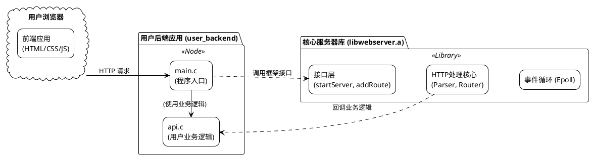
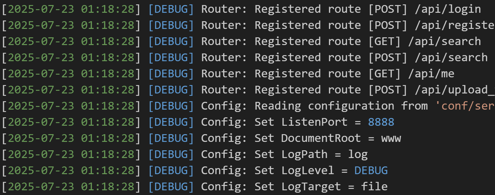
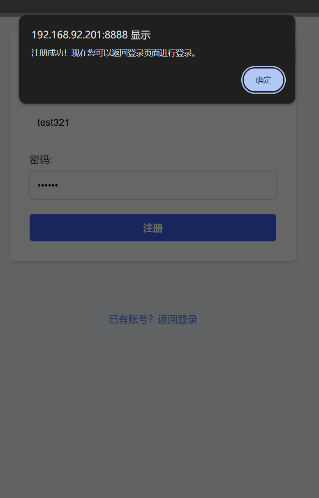
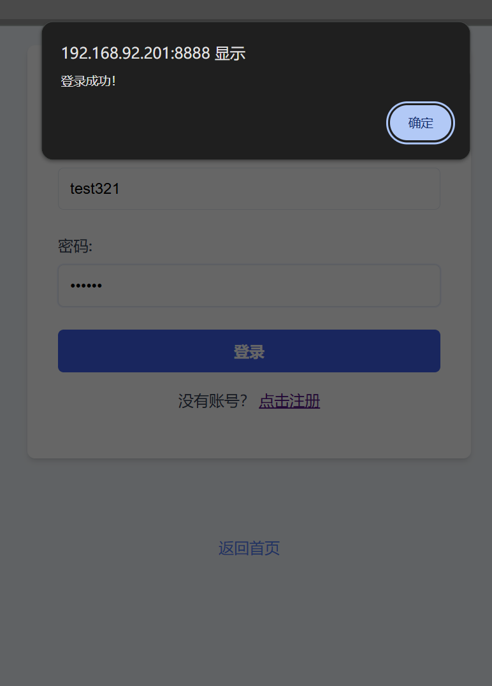

### 项目概述

我设计并实现一个功能完备、架构先进、可作为通用库使用的高性能轻量级Web服务器。此任务不仅综合运用了前两周在C语言、数据结构、Linux系统编程、网络编程、并发模型等方面的所有知识，更引入了HTTP协议解析、模块化程序库设计、第三方库集成（JWT）等更贴近真实工业级应用开发的复杂挑战。

最终，我成功交付了一个以 *epoll* I/O多路复用为核心、采用单线程Reactor并发模型的Web服务器框架。该框架以静态库 *libwebserver.a* 的形式提供，其内部实现了HTTP协议解析、动态路由、配置加载、双日志系统、JWT安全认证等核心功能。为验证框架的可用性与健壮性，我们还基于此库开发了一个完整的用户后端应用，并配套了具有注册、登录、查询等功能的前端界面。

本章将详细阐述此Web服务器的设计思路、核心功能实现、关键技术难点与最终成果展示。

#### 2.3.1 项目整体架构

为了实现高内聚、低耦合的设计目标，项目在顶层被清晰地划分为三个层次：**核心服务器库**、**用户后端应用** 和 **前端静态资源**。

-   **核心服务器库 (*epoll_server_core*)**: 项目的基石。它以 *libwebserver.a* 静态库的形式存在，封装了所有与网络I/O和HTTP协议处理相关的底层细节。其目标是为上层应用提供稳定、高效、易用的API，让业务开发者无需关心底层实现。
-   **用户后端应用 (*user_backend*)**: *libwebserver.a* 的一个具体使用者。它负责实现具体的业务逻辑，例如 */api/login*、*/api/register* 等接口。它通过调用核心库提供的路由注册函数，将特定的URL路径与自身的业务处理函数绑定，从而构建出一个完整的Web应用。
-   **前端静态资源 (*www/*)**: 纯粹的 *HTML*、*CSS*、*JavaScript* 和图片等文件，由用户后端应用所承载，通过核心服务器库的静态文件服务功能，最终呈现给终端用户浏览器。

三者之间的关系清晰明了，**如架构图 2-3-1 所示**。用户后端应用依赖于核心服务器库，而核心服务器库则为前端资源提供服务。这种分离的设计极大地提高了代码的可复用性和可维护性。



在核心服务器库内部，各模块也遵循着明确的依赖关系，**如核心库架构图 2-3-2 所示**。*Server* 模块作为主入口，协调 *Epoll*、*HTTP*、*Router* 等模块工作；*Logger* 和 *Config* 作为基础服务，被其他所有模块所依赖。


#### 2.3.2 核心服务逻辑 (Epoll Reactor模型)

本项目高性能的基石，是采用了Linux平台下最高效的I/O多路复用技术 *epoll*，并结合非阻塞I/O，构建了经典的**单线程Reactor并发模型**。

##### 2.3.2.1 核心优势

-   **高并发**: 单线程即可管理海量客户端连接，避免了传统“一来一线程”模型中因线程创建和上下文切换带来的巨大开销。
-   **事件驱动**: 只有当I/O事件（如新连接到达、数据可读、缓冲区可写）实际就绪时，CPU才介入处理，这极大地提升了系统资源的利用率，使得单个线程能发挥出最大效能。

##### 2.3.2.2 主事件循环

服务器的核心是 *server.c* 中的一个主事件循环，它阻塞在 *epoll_wait* 函数上，高效地等待I/O事件的发生。

**如核心代码 2-3-1 所示**，*epoll_wait* 返回后，循环会遍历所有就绪的事件：

1.  如果是监听 *socket* 就绪，意味着有新的客户端连接请求，则调用 *accept* 接受连接，并将其注册到 *epoll* 实例中以监听后续的读事件。
2.  如果是已连接的客户端 *socket* 可读（*EPOLLIN*），则调用 *handleConnection* 函数，从该 *socket* 读取数据并进行处理。
3.  如果是已连接的客户端 *socket* 可写（*EPOLLOUT*），则调用 *handleWrite* 函数，将缓冲区中待发送的数据写入该 *socket*。
4.  如果是连接关闭或发生错误，则调用 *closeConnection* 函数，清理资源。

```{.c caption="核心代码 2-3-1 主事件循环"}
// 核心代码 2-3-1 主事件循环 (server.c)
// ...
while (1) {
    int n = epoll_wait(epollFd, events, MAX_EVENTS, -1);
    for (int i = 0; i < n; i++) {
        if (events[i].data.fd == listenFd) {
            // 1. 如果是监听socket就绪，则接受新连接
            // ... accept, set non-blocking, add to epoll ...
        } else if (events[i].events & EPOLLIN) {
            // 2. 如果是客户端socket可读，则处理读事件
            Connection* conn = (Connection*)events[i].data.ptr;
            handleConnection(conn, &config, epollFd);
        } else if (events[i].events & EPOLLOUT) {
            // 3. 如果是客户端socket可写，则处理写事件
            Connection* conn = (Connection*)events[i].data.ptr;
            handleWrite(conn, &config, epollFd);
        } else {
            // 4. 处理其他事件（如断开连接）
            Connection* conn = (Connection*)events[i].data.ptr;
            closeConnection(conn, epollFd);
        }
    }
}
// ...
```

整个服务器的事件处理流程**如图 2-3-3 所示**，清晰地展示了服务器从接收连接到处理读写事件的完整生命周期。


##### 2.3.2.3 核心算法：增量式HTTP协议解析

由于TCP是面向字节流的协议，HTTP请求在网络传输中可能被拆分成多个数据包（“半包”），或者多个小请求被打包在一起一次性到达（“粘包”）。为了准确地从无边界的TCP流中识别出完整的HTTP请求，本项目设计并实现了**基于状态机的增量式解析算法**。

-   **状态机设计**: 为每个连接维护一个独立的解析状态（*parsing_state*），其流转过程为：*PARSE_STATE_REQ_LINE* → *PARSE_STATE_HEADERS* → *PARSE_STATE_BODY* → *PARSE_STATE_COMPLETE*。
-   **增量式处理**: 当 *epoll* 触发读事件后，服务器将新数据追加到该连接的读缓冲区（*read_buf*）。解析器则从上次解析结束的位置（*parsed_offset*）继续工作，根据当前状态寻找对应的协议边界符。例如，在 *PARSE_STATE_REQ_LINE* 状态下寻找请求行的结束符 *\r\n*。
-   **健壮性**: 如果在当前缓冲区中找到了边界符，则解析该部分内容，更新解析位置，并转换到下一个状态。如果未找到，则解析器暂停，保留当前状态和已解析的数据，等待下一次读事件带来更多数据。

这种增量式、带状态的解析方式，确保了服务器能够正确、高效地处理任意大小和任意分包情况的HTTP请求，是服务器能够稳定处理大文件上传等复杂场景的关键。

#### 2.3.3 静态资源服务与错误响应

作为Web服务器，最基础也是最重要的功能是向浏览器提供静态资源服务。

##### 2.3.3.1 训练要求

-   能够正确提供HTML页面、CSS样式表、JavaScript脚本、图片（GIF, JPEG）和图标（ICO）等多种类型的文件。
-   当用户请求根路径（*/*）或 */index.html* 时，能返回默认的首页。
-   能够处理多级目录的资源请求（如 */images/server.jpeg*）。
-   当用户请求的资源不存在时，能够返回符合HTTP规范的 *404 Not Found* 错误页面。

##### 2.3.3.2 核心代码与解释

所有静态资源请求都由 *http.c* 中的 *handleStaticRequest* 函数统一处理。

第一步，**如核心代码 2-3-2 所示**，函数会根据配置的网站根目录（*DocumentRoot*）和用户请求的URI，安全地拼接成服务器上的物理文件路径，并对“目录穿越”攻击（*../*）进行基本的安全检查。

```{.c caption="核心代码 2-3-2 静态文件路径构建与安全检查"}
// 核心代码 2-3-2 静态文件路径构建与安全检查 (http.c)
// ...
char path[MAX_PATH_LEN];
snprintf(path, sizeof(path), "%s%s", config->document_root, uri);

// Security check: simple but effective check for path traversal.
if (strstr(path, "../") != NULL) {
    log_system(LOG_WARNING, "Static: Path traversal attempt blocked for URI '%s'", uri);
    // ... send 403 Forbidden response ...
    return;
}
// ...
```

第二步，尝试打开文件。如果文件打开失败，**如核心代码 2-3-3 所示**，则会检查失败原因。如果是 *ENOENT*（文件不存在），则构建并发送 *404 Not Found* 响应；如果是其他权限问题，则发送 *403 Forbidden*。

```{.c caption="核心代码 2-3-3 404错误处理"}
// 核心代码 2-3-3 404错误处理 (http.c)
// ...
int fileFd = open(path, O_RDONLY);
if (fileFd == -1) {
    if (errno == ENOENT) { // File Not Found
        log_access(conn->client_ip, method, uri, 404);
        char response[] = "HTTP/1.1 404 Not Found\r\nConnection: close\r\n\r\nNot Found";
        queue_data_for_writing(conn, response, sizeof(response) - 1, epollFd);
    }
    // ... other error handling
    return;
}
// ...
```

第三步，如果文件成功打开，**如核心代码 2-3-4 所示**，服务器会获取文件大小，并通过 *getMimeType* 工具函数根据文件扩展名推断出正确的 *Content-Type*（MIME类型）。然后，构建包含正确状态码（*200 OK*）、*Content-Type* 和 *Content-Length* 的HTTP响应头，并将其放入待发送队列。

最后，循环读取文件内容，分块放入发送队列，等待 *epoll* 的 *EPOLLOUT* 事件触发后发送给客户端。

```{.c caption="核心代码 2-3-4 构建成功响应头"}
// 核心代码 2-3-4 构建成功响应头 (http.c)
// ...
const char* mime_type = getMimeType(path); // e.g., "text/html"
struct stat fileStat;
fstat(fileFd, &fileStat); // Get file size

char header[512];
int headerLen = snprintf(header, sizeof(header),
                         "HTTP/1.1 200 OK\r\n"
                         "Content-Type: %s\r\n"
                         "Content-Length: %ld\r\n\r\n",
                         mime_type, fileStat.st_size);
queue_data_for_writing(conn, header, headerLen, epollFd);

// ... loop to read file content and queue for writing ...
// ...
```

##### 2.3.3.3 运行效果与截图

通过浏览器访问服务器，**如图 2-3-4 所示**，博客首页 *index.html* 被成功加载，并且页面中引用的CSS样式、JS脚本和图片也一并被正确请求和渲染。


当尝试访问一个不存在的URL时，**如图 2-3-5 所示**，服务器按预期返回了简洁的 `404 Not Found` 错误提示，符合设计要求。


#### 2.3.4 配置系统与日志系统

为了提高服务器的灵活性、可观察性和可维护性，本项目设计了完善的外部配置系统和双日志系统。

##### 2.3.4.1 训练要求

-   服务器核心参数（如监听端口、网站根目录、日志级别等）可通过外部配置文件 *server.conf* 进行设置，无需重新编译代码。
-   实现双日志系统：*access.log* 用于记录所有HTTP访问摘要，*system.log* 用于记录服务器内部的运行状态、调试信息和错误。
-   日志系统需支持不同级别（DEBUG, INFO, WARNING, ERROR），并可按配置的级别进行过滤。

##### 2.3.4.2 核心代码与解释

**配置文件加载**

服务器启动时，*config.c* 中的 *loadConfig* 函数负责解析配置文件。**如核心代码 2-3-5 所示**，该函数首先为所有配置项设置一套合理的默认值。然后，它逐行读取配置文件，跳过注释和空行，使用 *sscanf* 匹配“键 = 值”的格式，并用读取到的值覆盖对应的默认配置。

```{.c caption="核心代码 2-3-5 配置文件解析逻辑"}
// 核心代码 2-3-5 配置文件解析逻辑 (config.c)
// ...
// 1. Set default values
config->listen_port = 8080;
strcpy(config->document_root, "www");
// ...

// 2. Read file and overwrite defaults
FILE* fp = fopen(filepath, "r");
if (!fp) { /* handle error */ }

while (fgets(line, sizeof(line), fp)) {
    if (sscanf(line, "%255s = %255s", key, value) != 2) {
        continue;
    }

    if (strcmp(key, "ListenPort") == 0) {
        config->listen_port = atoi(trimmed_value);
    } else if (strcmp(key, "LogLevel") == 0) {
        // ... set log level
    }
    // ... and so on for other keys
}
// ...
```

**亮点：启动时日志缓冲**

在服务器启动初期，*server.conf* 尚未被完全加载和解析，此时日志系统（如日志文件路径、日志级别）的配置是未知的。如果此时有日志需要记录（例如，报告“正在加载配置文件”），就会陷入“鸡生蛋”的困境。

为了解决这个问题，本项目在 *logger.c* 中设计了巧妙的**日志缓冲机制**。**如核心代码 2-3-6 所示**，在日志系统正式初始化之前，所有对 *log_system* 的调用都会将日志消息（连同其级别和时间戳）暂存到一个动态的内存缓冲区中。

```{.c caption="核心代码 2-3-6 日志消息缓冲"}
// 核心代码 2-3-6 日志消息缓冲 (logger.c)
// ...
void log_system(LogLevel level, const char* format, ...) {
    // If the logger is not yet initialized, buffer the message.
    if (!L.is_initialized) {
        // ... code to expand buffer if needed ...
        
        // Format message and store in buffer
        vasprintf(&message, format, args);
        log_buffer[buffer_count].level = level;
        log_buffer[buffer_count].message = message;
        buffer_count++;
        return;
    }
    // ... normal logging logic ...
}
// ...
```

当 *config.c* 调用 *logger_init* 函数，根据最终配置完成日志系统（如打开日志文件）的初始化后，**如核心代码 2-3-7 所示**，*logger_init* 会立即调用 *flush_and_free_buffer* 函数，将缓冲区中暂存的所有日志，按照最终确定的格式和目标，一次性“回放”并写入到正确的日志文件中。

```{.c caption="核心代码 2-3-7 日志缓冲回放"}
// 核心代码 2-3-7 日志缓冲回放 (logger.c)
// ...
int logger_init(LogLevel level, LogTarget target, const char* log_path) {
    // ... open log files based on config ...
    L.is_initialized = true;
    
    // Now that the logger is configured, flush any buffered logs
    flush_and_free_buffer();

    return 0;
}
// ...
```

这个设计确保了从服务器启动第一刻起的所有日志信息都不会丢失，并且都能按最终配置被正确记录。

##### 2.3.4.3 运行效果与截图

**如图 2-3-6 所示**的 *server.conf* 文件，清晰地展示了各项可配置参数。


服务器运行后，*log* 目录下生成了相应的日志文件。**如图 2-3-7 所示**，*system.log* 详细记录了服务器的启动过程、配置加载、路由注册等内部状态，其中可以看到日志缓冲机制生效，早期日志被成功记录。而 *access.log* 则忠实地记录了每一次外部HTTP请求的摘要信息。




#### 2.3.5 动态API服务 (GET/POST) 与路由

除了提供静态文件，一个现代Web服务器框架必须能处理动态API请求。本项目通过一个灵活的路由系统，实现了将不同的HTTP方法和URL路径分发给不同业务逻辑处理函数的能力。

##### 2.3.5.1 训练要求

-   实现一个路由系统，能将请求精确匹配到对应的C函数进行处理。
-   能同时支持 *GET* 和 *POST* 方法。
-   *GET* 请求能正确解析URL查询字符串中的参数。
-   *POST* 请求能正确解析 *application/x-www-form-urlencoded* 格式的请求体中的参数。

##### 2.3.5.2 核心代码与解释

**路由注册**

*user_backend* 的 *main.c* 文件是路由注册的中心。**如核心代码 2-3-8 所示**，在服务器启动前，它调用核心库提供的 *router_add_route* 函数，将API路径（如 */api/search*）和HTTP方法（*GET* 或 *POST*）与 *api.c* 中定义的具体业务处理函数（如 *handle_api_search*）进行绑定。

```{.c caption="核心代码 2-3-8 路由注册"}
// 核心代码 2-3-8 路由注册 (user_backend/src/main.c)
// ...
// Initialize the router and register routes
router_init();
router_add_route("GET", "/api/search", handle_api_search);
router_add_route("POST", "/api/search", handle_api_search_post);
router_add_route("POST", "/api/login", handle_api_login);
router_add_route("GET", "/api/me", handle_api_me);
// ...
```

当请求到达时，*server.c* 中的主处理函数会调用 *router_find_handler* 来查找匹配的处理器。如果找到，则执行对应的业务函数；如果找不到，则默认回退到静态文件服务逻辑。

**参数解析**

本项目通过 *utils.c* 中的 *get_query_param* 工具函数来解析键值对形式的参数。这个函数能够处理 *key1=value1&key2=value2* 格式的字符串。

**如核心代码 2-3-9 所示**，*GET* 和 *POST* 的处理函数逻辑非常相似，唯一的区别在于它们向 *get_query_param* 传入了不同的参数来源：

-   *handle_api_search* (GET) 将**请求的查询字符串**（*conn->request.raw_query_string*）作为解析目标。
-   *handle_api_search_post* (POST) 将**请求体**（*conn->request.body*）作为解析目标。

这种设计清晰地实现了对不同HTTP方法的数据承载方式的支持。

```{.c caption="核心代码 2-3-9 GET/POST参数解析"}
// 核心代码 2-3-9 GET/POST参数解析 (user_backend/src/api.c)
// ...
// GET request handler:
void handle_api_search(Connection* conn, ServerConfig* config, int epollFd) {
    // ...
    // GET request: parse from query string
    filename_key = get_query_param(conn->request.raw_query_string, "filename");
    search_key = get_query_param(conn->request.raw_query_string, "keyword");
    // ...
} 

// POST request handler:
void handle_api_search_post(Connection* conn, ServerConfig* config, int epollFd) {
    // ...
    // POST request: parse from request body
    if (conn->request.body) {
        filename_key = get_query_param(conn->request.body, "filename");
        search_key = get_query_param(conn->request.body, "keyword");
    }
    // ...
}
// ...
```

##### 2.3.5.3 运行效果与截图

在前端的查询页面中，我们设计了两个独立的表单，分别通过 *GET* 和 *POST* 方法提交数据。

**如图 2-3-9 所示**，使用 *GET* 表单进行查询，浏览器地址栏中清晰地显示了编码后的查询参数，服务器成功解析并返回了正确的结果。


**如图 2-3-10 所示**，使用 `POST` 表单进行查询，参数被包含在请求体中，地址栏保持干净。服务器同样成功解析并返回了正确结果，证明动态API服务功能完善。


#### 2.3.6 安全认证 (JWT)

为实现一个功能完整的Web服务框架，安全认证是必不可少的一环。本项目采用业界广泛使用的 **JSON Web Token (JWT)** 标准，实现了一套完整的用户注册、登录和接口访问权限控制流程。

##### 2.3.6.1 训练要求

-   集成第三方 *l8w8jwt* C语言库来处理JWT的生成与验证。
-   实现 */api/register* 接口，允许新用户注册，并将用户信息持久化（本项目简化为存入 *users.csv* 文件）。
-   实现 */api/login* 接口，校验用户凭据，成功后生成一个包含用户信息的、有时间限制的、使用秘钥签名的JWT并返回给客户端。
-   实现受保护的 */api/me* 接口，该接口必须在请求的 *Authorization* 头中携带合法有效的JWT才能访问，否则返回 *401 Unauthorized* 错误。

##### 2.3.6.2 核心代码与解释

**用户登录与Token生成**

当用户通过 */api/login* 登录并验证成功后，**如核心代码 2-3-10 所示**，业务逻辑会调用 *auth.c* 中封装的 *generate_token_for_user* 函数。该函数使用 *l8w8jwt* 库来创建一个JWT。

在创建过程中，它设置了关键的声明（claims）：

-   *sub* (Subject): 存入用户名，标识此Token属于谁。
-   *iss* (Issuer): 签发者，即本服务器。
-   *iat* (Issued At): 签发时间。
-   *exp* (Expiration Time): 过期时间（本项目设为15分钟后），确保Token不会永久有效。

最后，使用在 *server.conf* 中配置的秘钥（*JwtSecret*）和 *HS256* 算法对Token进行签名，防止内容被篡改。

```{.c caption="核心代码 2-3-10 JWT生成"}
// 核心代码 2-3-10 JWT生成 (epoll_server_core/src/auth.c)
// ...
char* generate_token_for_user(const char* username, ServerConfig* config) {
    // ...
    struct l8w8jwt_encoding_params params;
    l8w8jwt_encoding_params_init(&params);

    params.alg = L8W8JWT_ALG_HS256;
    params.sub = (char*)username;                 // 主题：用户名
    params.iss = "my-web-server";                // 签发者
    params.iat = time(NULL);                     // 签发时间
    params.exp = time(NULL) + (15 * 60);         // 过期时间 (15分钟)
    params.secret_key = (unsigned char*)config->jwt_secret; // 签名秘钥
    params.secret_key_length = strlen(config->jwt_secret);
    
    int r = l8w8jwt_encode(&params);
    // ...
}
// ...
```

**Token验证与接口保护**

当客户端访问受保护的接口（如 */api/me*）时，*api.c* 会调用 *auth.c* 中的 *authenticate_request* 函数。**如核心代码 2-3-11 所示**，该函数首先从请求头中提取 *Authorization: Bearer <token>* 里的 *token* 部分。

然后，它同样使用 *l8w8jwt* 库来解码并验证此Token。验证过程包括：

1.  **签名校验**: 使用相同的秘钥检查签名是否匹配，确保Token未被篡改。
2.  **过期校验**: 检查当前时间是否晚于Token的 *exp* 声明，确保Token未过期。

只有当所有验证全部通过，函数才会从Token的 *sub* 声明中解析出用户名并返回，表示授权成功。否则，返回 *NULL*，表示授权失败。

```{.c caption="核心代码 2-3-11 JWT验证"}
// 核心代码 2-3-11 JWT验证 (epoll_server_core/src/auth.c)
// ...
char* authenticate_request(Connection* conn, ServerConfig* config) {
    // ...
    // 1. Find the Authorization: Bearer <token> header
    const char* token = auth_header + 7;
    
    struct l8w8jwt_decoding_params params;
    l8w8jwt_decoding_params_init(&params);
    params.jwt = (char*)token;
    params.verification_key = (unsigned char*)config->jwt_secret;
    params.validate_exp = 1; // Enable expiration check

    enum l8w8jwt_validation_result validation_result;
    int decode_result = l8w8jwt_decode(&params, &validation_result, ...);

    if (decode_result == L8W8JWT_SUCCESS && validation_result == L8W8JWT_VALID) {
        // Validation successful, extract username from "sub" claim
        // ...
        return username;
    }
    return NULL; // Validation failed
}
// ...
```

##### 2.3.6.3 运行效果与截图

安全认证的完整流程演示如下：

1.  **注册新用户**: **如图 2-3-11 所示**，在注册页面创建一个新账号。
2.  **登录获取Token**: **如图 2-3-12 所示**，使用刚注册的账号登录，服务器返回成功信息和JWT。前端JS会自动将此Token保存到本地存储中。
3.  **鉴权访问**: **如图 2-3-13 所示**，当访问“我的”页面时，前端JS会自动在请求头中附上已保存的Token。服务器验证Token通过，成功返回该用户的个人信息，页面显示欢迎语。如果直接访问或Token无效，则会被自动重定向回登录页。



