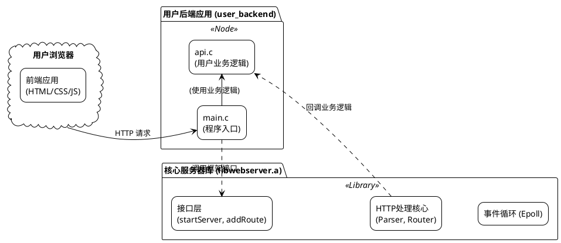
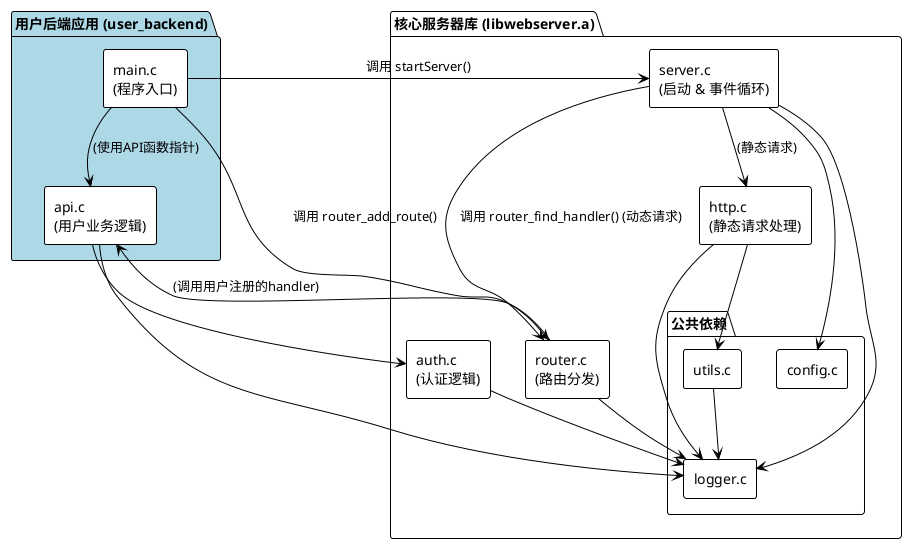
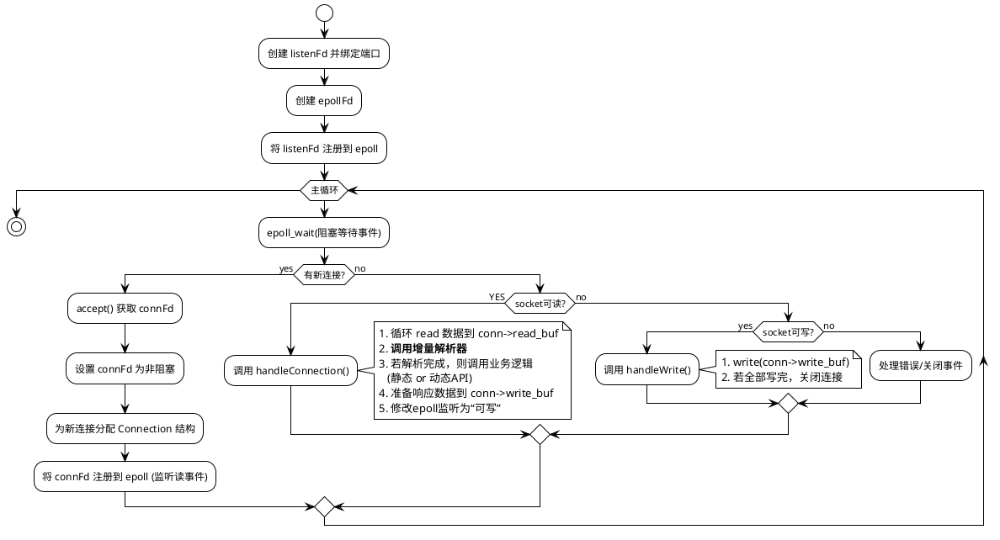

<!-- _header: '' -->

# 基于epoll的高性能轻量级Web服务器
## 设计与实现

- **汇报人：谭宇轩**
- **日期：2025年7月22日**

---

<!-- _header: '项目概述' -->

## 项目定位：一个框架，而非应用

本次项目旨在开发一个**轻量级、可嵌入的Web服务器『框架』**。

- **核心价值**: 提供稳定可靠的HTTP处理核心，将开发者从复杂的底层I/O与协议解析中解放出来。
- **设计哲学**: 给予上层业务开发者最大的**自由度**去实现自定义逻辑。
- **本次展示**: 为演示框架能力，我们基于此框架构建了一个**示例后端应用** (`user_backend`) 和配套的前端界面。

---

<!-- _header: '项目概述' -->

## 整体架构

项目由**前端应用**、**用户后端**和**核心服务器库**三部分组成，关系如下：



---

<!-- _header: '核心库设计' -->

## 核心库内部依赖关系

`libwebserver.a` 内部模块职责清晰，依赖关系明确，体现了高内聚、低耦合的设计思想。



---

<!-- _header: '核心库设计' -->

## 项目目录结构

规范的目录结构保证了项目代码的清晰度和可维护性。

```
.
├── Web_Server_for_Learning/  # 核心服务器库
│   ├── src/                  # 核心库源文件 (*.c)
│   ├── include/              # 核心库头文件 (*.h)
│   ├── deps/                 # 第三方依赖 (l8w8jwt)
│   ├── lib/                  # 生成的 libwebserver.a
│   └── Makefile              # 库编译脚本
├── user_backend/             # 用户示例应用
│   ├── src/                  # 用户业务逻辑 (api.c, main.c)
│   ├── include/
│   ├── www/                  # 前端静态资源 (html, css, js)
│   ├── log/                  # 日志文件 (access.log, system.log)
│   ├── conf/                 # 配置文件 (server.conf)
│   └── Makefile              # 应用编译脚本
└── ...
```

---
<!-- _header: '功能巡礼' -->

## 功能点展示顺序

接下来，我们将按照以下顺序，结合代码和现场演示，逐一介绍服务器的核心功能：

1.  **静态服务** (Index/博客) **& 错误响应**
2.  **配置系统 & 日志系统**
3.  **动态服务** (GET / POST 实现)
4.  **安全认证**
5.  **核心服务逻辑** (Epoll)

---

<!-- _header: '功能巡礼 | 1. 静态服务 & 错误响应' -->

### 1. 静态服务 & 错误响应 (概述)

- **功能**: 作为Web服务器，首要能力是提供静态资源服务，包括HTML页面、CSS样式表、JavaScript脚本和图片等。同时，当用户请求不存在的资源时，能返回规范的`404 Not Found`错误页面。

- **演示内容**:
  - 访问博客首页 `index.html`。
  - 首页能成功加载图片、CSS和JS文件。
  - 访问一个不存在的URL，服务器返回404错误页面。

---

<!-- _header: '功能巡礼 | 1. 静态服务 & 错误响应' -->

### 核心逻辑

`http.c`中的`handleStaticRequest`函数负责所有静态请求。

首先，它将请求的URI与配置的文档根目录安全地拼接成物理文件路径。
```c
// in http.c
char path[MAX_PATH_LEN];
snprintf(path, sizeof(path), "%s%s", config->document_root, uri);
```
然后，尝试打开文件。如果失败（如文件不存在），则构建并发送404响应。
```c
// in http.c
int fileFd = open(path, O_RDONLY);
if (fileFd == -1) {
    if (errno == ENOENT) { // File Not Found
        log_access(conn->client_ip, method, uri, 404);
        char response[] = "HTTP/1.1 404 Not Found\r\n...";
        queue_data_for_writing(conn, response, ...);
    }
    // ... other error handling
    return;
}
```
---
<!-- _header: '功能巡礼 | 1. 静态服务 & 错误响应' -->

### 核心逻辑 (续)
如果文件打开成功，则根据文件后缀名获取正确的MIME类型，并构建`200 OK`响应头。
```c
// in http.c
const char* mime_type = getMimeType(path); // e.g., "text/html"
char header[512];
int headerLen = snprintf(header, sizeof(header),
                         "HTTP/1.1 200 OK\r\n"
                         "Content-Type: %s\r\n"
                         "Content-Length: %ld\r\n\r\n",
                         mime_type, fileStat.st_size);
queue_data_for_writing(conn, header, headerLen, epollFd);
```
最后，循环读取文件内容，并将其写入响应队列，等待发送。
```c
// in http.c
char buffer[4096];
ssize_t bytesRead;
while ((bytesRead = read(fileFd, buffer, sizeof(buffer))) > 0) {
    queue_data_for_writing(conn, buffer, bytesRead, epollFd);
}
```

---
<!-- _header: '功能巡礼 | 1. 静态服务 & 错误响应' -->

### 运行结果展示

`[请在此处准备并插入 index.html 和 404页面的运行截图]`

- **左图**: 成功加载的博客首页，包含文字、图片和CSS样式。
- **右图**: 访问不存在的URL时，服务器返回的404错误页面。

---
<!-- _header: '功能巡礼 | 2. 配置与日志系统' -->

### 2. 配置与日志系统 (概述)

- **功能**: 为了提高灵活性和可维护性，服务器的行为由外部`server.conf`文件驱动。同时，系统配备了完善的双日志系统，用于追踪访问和排查问题。

- **演示内容**:
  - 展示 `server.conf` 文件的内容，说明可配置项。
  - 启动服务器，并查看 `log/` 目录下生成的 `access.log` 和 `system.log`。

---
<!-- _header: '功能巡礼 | 2. 配置与日志系统' -->

### 核心逻辑：配置文件加载
服务器启动时，`config.c`中的`loadConfig`函数会逐行解析配置文件。
它首先为所有配置项设置合理的默认值，然后读取文件，用`sscanf`和`strcmp`匹配键值对并覆盖默认值。
```c
// in config.c
while (fgets(line, sizeof(line), fp)) {
    char key[256], value[256];
    if (sscanf(line, "%255s = %255s", key, value) != 2) {
        continue;
    }

    if (strcmp(key, "ListenPort") == 0) {
        config->listen_port = atoi(trimmed_value);
    } else if (strcmp(key, "LogLevel") == 0) {
        // ... set log level
    }
    // ...
}
```
---
<!-- _header: '功能巡礼 | 2. 配置与日志系统' -->

### 亮点：启动时日志缓冲
在配置文件加载完成前，日志系统如何工作？这是一个“鸡生蛋”问题。
我们设计了巧妙的日志缓冲机制：在日志系统未初始化时，`log_system`会将日志消息暂存入内存缓冲区。
```c
// in logger.c -> log_system()
if (!L.is_initialized) {
    // ... code to expand buffer if needed ...
    
    // Format message and store in buffer
    vasprintf(&message, format, args);
    log_buffer[buffer_count].level = level;
    log_buffer[buffer_count].message = message;
    buffer_count++;
    return;
}
```
当`logger_init`根据配置完成初始化后，它会立即“回放”并清空缓冲区，确保所有日志都按最终配置输出。
```c
// in logger.c -> logger_init()
L.is_initialized = true;
// Now that the logger is configured, flush any buffered logs
flush_and_free_buffer();
```
---
<!-- _header: '功能巡礼 | 2. 配置与日志系统' -->

### 运行结果展示

`[请在此处准备并插入 server.conf 和 log/目录下两个日志文件的截图]`

- **左上**: `server.conf`文件，展示了端口、日志级别等配置。
- **右侧**: `system.log`文件，展示了服务器启动、模块加载等`DEBUG`级别的详细信息。
- **左下**: `access.log`文件，记录了每一条HTTP请求的摘要。

---
<!-- _header: '功能巡礼 | 3. 动态服务 (GET/POST)' -->

### 3. 动态服务 (GET/POST) (概述)
- **功能**: 服务器不仅能提供静态文件，还能处理动态API请求。我们通过一个“学生数据查询”功能，来演示服务器如何通过路由系统，将`GET`和`POST`请求分发给不同的业务逻辑。

- **演示内容**:
  - 打开学生查询页面。
  - 分别使用`GET`表单（参数在URL中）和`POST`表单（参数在请求体中）查询数据。
  - 服务器均能正确响应，并将结果动态渲染在页面表格中。

---
<!-- _header: '功能巡礼 | 3. 动态服务 (GET/POST)' -->

### 核心逻辑：路由注册与参数解析
在`main.c`中，我们将同一路径`/api/search`分别注册给GET和POST方法，并绑定到不同的处理函数。
```c
// in user_backend/src/main.c
router_add_route("GET", "/api/search", handle_api_search);
router_add_route("POST", "/api/search", handle_api_search_post);
```
在`api.c`中，`GET`处理函数从**请求的查询字符串**中解析参数。
```c
// in user_backend/src/api.c -> handle_api_search()
filename_key = get_query_param(conn->request.raw_query_string, "filename");
search_key = get_query_param(conn->request.raw_query_string, "keyword");
```
而`POST`处理函数从**请求体**中解析参数，实现了对不同HTTP方法的支持。
```c
// in user_backend/src/api.c -> handle_api_search_post()
filename_key = get_query_param(conn->request.body, "filename");
search_key = get_query_param(conn->request.body, "keyword");
```
---
<!-- _header: '功能巡礼 | 3. 动态服务 (GET/POST)' -->

### 运行结果展示

`[请在此处准备并插入 search.html 演示GET和POST查询成功的截图]`

- **截图内容**: 展示`search.html`页面，上面是GET表单，下面是POST表单，最下方是查询结果的表格，表格中显示了从.csv文件中查找到的学生信息。

---
<!-- _header: '功能巡礼 | 4. 安全认证' -->

### 4. 安全认证 (概述)
- **功能**: 作为一个功能完善的框架，我们提供了完整的安全认证流程。用户可以注册新账号，登录后获取`JWT (JSON Web Token)`，并在后续请求中携带此Token以访问受保护的资源。

- **演示内容**:
  - (未登录)直接访问“我的”页面，被自动跳转到登录页。
  - 在注册页面创建一个新用户。
  - 使用新用户登录，登录成功后自动跳转到“我的”页面，并显示欢迎信息。

---
<!-- _header: '功能巡礼 | 4. 安全认证' -->

### 核心逻辑：用户注册与登录
用户注册时，`handle_api_register`会检查用户名是否已存在，若不存在，则将新用户信息追加到`users.csv`文件。
```c
// in user_backend/src/api.c
// ... check if user_exists ...
fp = fopen("www/data/users.csv", "a");
if (fp) {
    fprintf(fp, "\n%s,%s", username, password); // Append new user
    fclose(fp);
    status_code = 201; // Created
}
```
用户登录时，`handle_api_login`会校验凭据，成功后调用`auth.c`中的函数生成JWT。
```c
// in user_backend/src/api.c
if (credentials_valid) {
    // Call auth module to create a token
    char* token_str = generate_token_for_user(username, config);
    // ... build JSON response with token ...
}
```

---
<!-- _header: '功能巡礼 | 4. 安全认证' -->

### 核心逻辑：Token验证
访问受保护接口时，`auth.c`中的`authenticate_request`函数会解析`Authorization`请求头，并使用`l8w8jwt`库来验证Token的签名和有效期。
```c
// in Web_Server_for_Learning/src/auth.c
// ... find "Authorization: Bearer <token>" header ...
struct l8w8jwt_decoding_params params;
l8w8jwt_decoding_params_init(&params);
params.jwt = (char*)token;
params.verification_key = (unsigned char*)config->jwt_secret;
// ... set other params ...

int decode_result = l8w8jwt_decode(&params, &validation_result, ...);

if (decode_result == L8W8JWT_SUCCESS && validation_result == L8W8JWT_VALID) {
    // Validation successful, return username from "sub" claim
    username = strdup(sub_claim->value);
}
```
---
<!-- _header: '功能巡礼 | 4. 安全认证' -->

### 运行结果展示
`[请在此处准备并插入 注册、登录、访问个人中心 的系列连贯截图]`

- **图一**: `register.html`页面，显示注册成功提示。
- **图二**: `login.html`页面，输入用户名密码，点击登录。
- **图三**: `me.html`页面，成功显示“欢迎, [用户名]!”，证明Token验证通过。

---
<!-- _header: '功能巡礼 | 5. 核心服务逻辑 (Epoll)' -->

### 5. 核心服务逻辑 (Epoll) (概述)
- **功能**: 这是整个服务器高性能的基石。我们采用Linux平台下最高效的I/O多路复用技术`epoll`，并结合**非阻塞I/O**，构建了经典的**单线程Reactor并发模型**。

- **核心优势**:
  - **高并发**: 单线程即可管理海量客户端连接，避免了多线程上下文切换的巨大开销。
  - **事件驱动**: 只有当I/O事件实际就绪时，CPU才介入处理，极大提升了资源利用率。

---
<!-- _header: '功能巡礼 | 5. 核心服务逻辑 (Epoll)' -->

### 核心逻辑：主事件循环
服务器的核心是`server.c`中的一个无限循环，它阻塞在`epoll_wait`，等待事件发生。
```c
// in Web_Server_for_Learning/src/server.c
while (1) {
    int n = epoll_wait(epollFd, events, MAX_EVENTS, -1);
    for (int i = 0; i < n; i++) {
        if (events[i].data.fd == listenFd) {
            // 1. 如果是监听socket就绪，则接受新连接
            // ... accept, set non-blocking, add to epoll ...
        } else if (events[i].events & EPOLLIN) {
            // 2. 如果是客户端socket可读，则处理读事件
            handleConnection(conn, &config, epollFd);
        } else if (events[i].events & EPOLLOUT) {
            // 3. 如果是客户端socket可写，则处理写事件
            handleWrite(conn, &config, epollFd);
        } else {
            // 4. 处理其他事件（如断开连接）
            closeConnection(conn, epollFd);
        }
    }
}
```
---
<!-- _header: '功能巡礼 | 5. 核心服务逻辑 (Epoll)' -->

### 核心逻辑：事件处理流程图
下图完整展示了服务器从接收连接到处理读写事件的完整流程。


---
<!-- _header: '功能巡礼 | 5. 核心服务逻辑 (Epoll)' -->

### 核心算法：增量式HTTP解析
- **挑战**: TCP是面向字节流的协议，一个HTTP请求可能被分割在多个TCP包中（半包），或多个请求挤在一个包里（粘包）。如何准确识别请求边界？

- **解决方案**: **基于状态机的增量式解析算法**。
  - 为每个连接维护一个独立的读缓冲区 (`read_buf`) 和解析状态 (`parsing_state`)。
  - `epoll` 每次触发读事件，都从socket `read` 数据追加到缓冲区。
  - 解析器从上次结束的位置 (`parsed_offset`) 继续扫描，根据当前状态（如 `PARSE_STATE_REQ_LINE`）寻找对应的分隔符（`\r\n`）。
  - **找到则转换到下一状态**，更新偏移量；**找不到则保留当前状态**，等待下一次读事件。
  
> 此设计是服务器能成功通过“超长消息（大文件上传）”测试的关键。

---

<!-- _header: '总结与展望' -->

## 项目总结

- **架构先进**: 成功实现了**库/应用分离**的高内聚低耦合架构，并采用业界成熟的 **Reactor** 模型，保证了高性能与高并发。
- **功能完备**: 完整实现了静态服务、动态API、安全认证、外部配置、双日志系统等Web服务器核心功能。
- **技术扎实**: 攻克了基于 `epoll` ET 模式的**非阻塞I/O编程**，并设计了健壮的**增量式协议解析器**和巧妙的**日志缓冲机制**等核心技术难点。

---

<!-- _header: '总结与展望' -->

## 不足与展望

- **API封装**: 目前的用户API处理函数暴露了较多底层细节（如`epollFd`），未来可设计更上层的API，由框架统一处理响应发送和日志记录，进一步降低用户使用门槛。
- **性能优化**: 可引入多线程或线程池模型，将CPU密集型的业务逻辑（如复杂的API处理）与I/O线程分离，充分利用多核优势，进一步提升性能。
- **功能扩展**:
  - 支持 **HTTPS** (通过集成OpenSSL)。
  - 实现更完善的 **HTTP/1.1 Keep-Alive** 策略。

---

<!-- _header: '' -->

# 感谢聆听
## Q & A